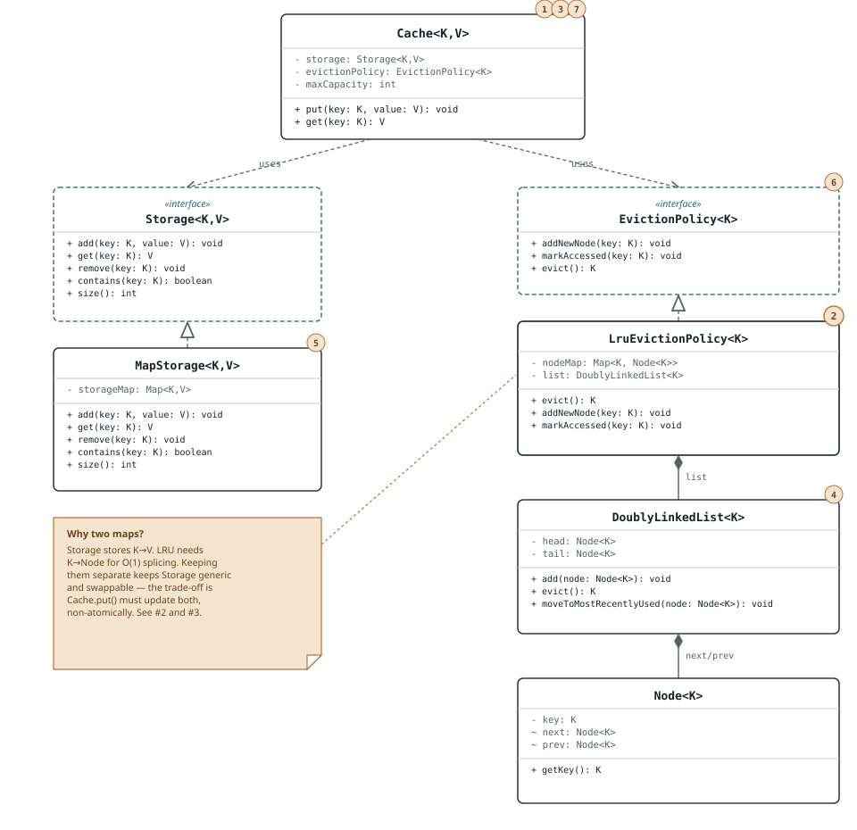
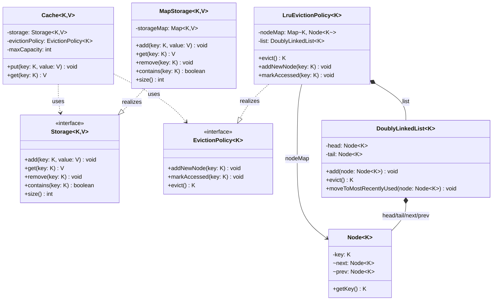

# LRU Cache — Revision Sheet

Reviewed: 2026-09-01
Package: `org.example.cache`

Current design already holds up under SOLID. This is the architecture as it
stands, plus the nine gaps between "clean interview solution" and
"production grade" — in the order to tackle them.

## Architecture

Two collaborators injected into `Cache` — `Storage` holds values,
`EvictionPolicy` holds recency order. `LruEvictionPolicy` keeps its own
`nodeMap`, separate from `Storage`'s map, so `Storage` stays generic and
`EvictionPolicy` stays generic over `K` alone — both swappable
independently. The cost: two sources of truth for "what keys exist,"
mutated in two separate steps inside `Cache.put`. That's exactly why #2
(thread-safety) can't be solved by locking `Storage` and `EvictionPolicy`
internally — the lock has to wrap both calls together, at the `Cache`
level. Numbers in brackets below cross-reference the punch list.



<details>
<summary>Mermaid source (if the SVG above doesn't render in your viewer)</summary>



</details>

Legend: dashed arrow = *uses* (dependency), dashed hollow-triangle =
*realizes* (implements interface), filled diamond = *owns* (composition).
Items #8 (tests) and #9 (Javadoc) apply to the whole file, not one box.

## SOLID checkpoint

The skeleton already holds up — nothing here needs a redesign, only the
production hardening below.

| Principle | Verdict | Note |
|---|---|---|
| **S** — Single Responsibility | Holds | `Storage` / `EvictionPolicy` / `Cache` / `DoublyLinkedList` each have one reason to change. |
| **O** — Open/Closed | Holds | A new policy (LFU, MRU) or backend plugs in without touching `Cache`. |
| **L** — Liskov | Holds | Nothing to violate yet — one implementation per interface. |
| **I** — Interface Segregation | Holds | Both interfaces are small and role-focused. |
| **D** — Dependency Inversion | Holds | `Cache` is constructor-injected with abstractions, not concretions. |

## Tomorrow's order

Correctness first, then a safety net, then the concurrency redesign, then polish.

```
1 → 3 → 5 → 8 → 2 → (4, 6, 7, 9)
```

## Punch list

All nine items, in the order they were raised — numbers match the diagram above.

### 1. Capacity is hardcoded — `Cache.java:10`
- **Why**: Every cache instance is stuck at 3 entries; no per-instance sizing, and a bare literal is a magic number.
- **How**: Add an `int maxCapacity` constructor parameter and validate `> 0`.

### 2. No thread-safety
- **Why**: Unsynchronized `HashMap` plus raw pointer surgery in `DoublyLinkedList` — concurrent `get`/`put` corrupts state. Biggest gap for "production."
- **How**: Lock at the `Cache` level around the pair of calls to `storage` and `evictionPolicy` — locking each collaborator separately isn't enough, since they must move together (see the two-map note above).

### 3. Silent inconsistency in `put()` — `Cache.java:26-27`
- **Why**: If `evictionPolicy.evict()` returns `null` while `storage.size() >= maxCapacity`, `storage.remove(null)` runs and the drift between the two maps goes unnoticed.
- **How**: Treat `null`-while-nonempty as a defect: throw `IllegalStateException` instead of continuing silently.

### 4. Leaky encapsulation in `Node` / `DoublyLinkedList`
- **Why**: `next`/`prev` are package-private mutable fields poked directly. Fine today since same package, easy to corrupt if the list ever gets a second caller.
- **How**: Keep as-is deliberately, or add package-private accessors and document that only `DoublyLinkedList` mutates links.

### 5. Ambiguous `null` semantics — `Storage.get` / `Cache.get`
- **Why**: `null` means "not found," indistinguishable from a legitimately cached `null` value.
- **How**: Switch to `Optional<V>`, or explicitly forbid `null` values and validate on `put`.

### 6. Dead import — `EvictionPolicy.java`
- **Why**: Imports `org.example.cache.lru.Node`, never used. Lint noise.
- **How**: Delete the import.

### 7. No input validation
- **Why**: `null` keys and non-positive capacity are unguarded — fails late and obscurely instead of at the boundary.
- **How**: Validate in the constructor and at `put`/`get` entry points; throw `IllegalArgumentException` with a clear message.

### 8. No automated tests
- **Why**: `Demo.java` is a manual println smoke test, not a regression net — can't safely refactor #1-#7 without one.
- **How**: JUnit coverage for eviction order, recency-refresh on update, capacity boundary, and the not-found path. Write these before touching thread-safety.

### 9. No Javadoc on the public API
- **Why**: Contracts like "`evict()` returns `null` when empty" or thread-safety guarantees aren't discoverable.
- **How**: Add class/method Javadoc last, once #1-#8 have settled what the contracts actually are.
