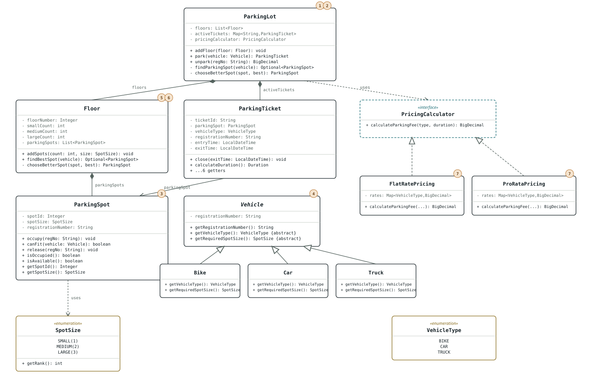
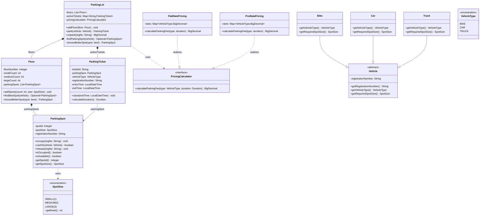

# Parking Lot — Revision Sheet

Reviewed: 2026-09-01
Package: `org.example.parking_lot`

Phase 1 already reads clean and interview-ready. This sheet is the
architecture as it stands today, plus the nine gaps between "clean
interview solution" and "production grade" — in the order to tackle them.

## Architecture

`ParkingLot` orchestrates: it owns the ordered `List<Floor>` and the
`activeTickets` map, and depends on `PricingCalculator` as an injected
abstraction. Selection is deliberately decomposed into two levels —
`Floor.findBestSpot()` picks the best spot *on that floor*, and
`ParkingLot.findParkingSpot()` picks the best *across floors* — but both
levels reimplement the identical `chooseBetterSpot()` tie-break logic
independently rather than sharing it. That's exactly why #5 below exists.
`ParkingTicket` owns session state and duration; `PricingCalculator` owns
the fee formula; `ParkingSpot` only ever answers "can I fit this vehicle /
am I occupied" and never sees a ticket or a price. Vehicle subtypes
(`Bike`/`Car`/`Truck`) map 1:1 to `SpotSize`, so today's model can't express
a vehicle needing a size the enum doesn't already have. Numbers in brackets
below cross-reference the punch list.



<details>
<summary>Mermaid source (if the SVG above doesn't render in your viewer)</summary>



</details>

Legend: dashed arrow = *uses* (dependency), dashed hollow-triangle =
*realizes* (implements interface), solid hollow-triangle = *extends*
(inheritance), filled diamond = *owns* (composition), solid arrow =
*references* (association). Items #8 (tests) and #9 (Javadoc) apply to the
whole file, not one box.

## SOLID checkpoint

The skeleton already holds up — nothing here needs a redesign, only the
production hardening below.

| Principle | Verdict | Note |
|---|---|---|
| **S** — Single Responsibility | Holds | `ParkingLot` orchestrates, `Floor` owns spots, `ParkingSpot` owns occupancy, `ParkingTicket` owns session state, `PricingCalculator` owns the fee formula — each has one reason to change. |
| **O** — Open/Closed | Mostly holds | A new `PricingCalculator` (e.g. surge pricing) plugs in without touching `ParkingLot`. Partial gap: a new `Vehicle` subtype still requires editing the `rates` map inside both pricing implementations (see #7) — that's a seam the interface doesn't cover. |
| **L** — Liskov | Holds | `Bike`/`Car`/`Truck` are pure data substitutions for `Vehicle`; nothing to violate with one implementation each. |
| **I** — Interface Segregation | Holds | `PricingCalculator` is a single-method, role-focused interface. |
| **D** — Dependency Inversion | Holds | `ParkingLot` is constructor-injected with `PricingCalculator` as an abstraction, not a concrete pricing class. |

## Tomorrow's order

Correctness first, then the concurrency the Demo already exercises, then
design cleanup, then tests, then polish.

```
1 → 3 → 2 → 5 → 6 → 7 → 4 → 8 → 9
```

## Punch list

All nine items, in the order they were raised — numbers match the diagram above.

### 1. `unpark()` fabricates the exit time — [ParkingLot.java:85](models/ParkingLot.java:85)
- **Why**: `ticket.close(LocalDateTime.now().plusHours(2))` bills every real unpark for a session two hours in the future instead of `LocalDateTime.now()`. Looks like leftover debug code to force a non-zero duration while manually testing fee math — but as it stands, it's a correctness bug that overcharges every single vehicle.
- **How**: Replace with `LocalDateTime.now()`.

### 2. `park()`'s thread-safety only covers half the method — [ParkingLot.java:26-51](models/ParkingLot.java:26)
- **Why**: The duplicate-registration check (`activeTickets.containsKey`, line 30) and the final `activeTickets.put` (line 49) both run *outside* the `synchronized` block that wraps spot selection. Two threads can both pass the duplicate check for the same registration before either inserts, and `HashMap` mutated concurrently from multiple threads can corrupt its internal state or lose entries. The `ParkingLotDemo` already spins up five concurrent entry-gate threads specifically to exercise this path, so this isn't a hypothetical — it's the scenario the Demo is built to test.
- **How**: Widen the `synchronized` block (or use a lock) to cover the duplicate check, spot selection/occupy, and the ticket-map insert as one atomic unit — or switch `activeTickets` to a `ConcurrentHashMap` and use `putIfAbsent` for the duplicate check plus a per-registration lock for the compound check-then-act.

### 3. `ParkingSpot.release()` NPEs on an already-free spot — [ParkingSpot.java:28-34](models/ParkingSpot.java:28)
- **Why**: `this.registrationNumber.equals(...)` is called unconditionally; if the spot is already vacant, `registrationNumber` is `null` and this throws `NullPointerException` instead of the intended "occupied by another vehicle" `RuntimeException`. Any double-release (e.g. a retried `unpark()`) crashes with the wrong exception.
- **How**: Check `isAvailable()` first and throw a clear "spot is not occupied" exception before comparing registration numbers.

### 4. Every failure path throws bare `RuntimeException` (or `IllegalArgumentException` inconsistently)
- **Why**: `ParkingLot`, `ParkingSpot`, `ParkingTicket`, and `Vehicle` each throw generic `RuntimeException` for distinct failure modes (duplicate vehicle, no spot available, ticket not found, already occupied, invalid exit time, blank registration) — except `ParkingLot`'s null-vehicle check, which throws `IllegalArgumentException` instead. Callers can't `catch` a specific failure without string-matching the message, and the exception type doesn't hint at what went wrong.
- **How**: Introduce a small domain-exception hierarchy (`SpotUnavailableException`, `DuplicateVehicleException`, `TicketNotFoundException`, `InvalidTicketStateException`, etc.) and use them consistently instead of `RuntimeException`.

### 5. `chooseBetterSpot()` is duplicated verbatim — [Floor.java:46-59](models/Floor.java:46) and [ParkingLot.java:64-77](models/ParkingLot.java:64)
- **Why**: The size-then-id tie-break is copy-pasted between `Floor` and `ParkingLot`. A future change to the tie-break rule (e.g. "prefer higher floor" or "prefer newer spot") has to be made in two places and can silently drift out of sync.
- **How**: Extract a shared `SpotComparator`/`SpotSelector` utility (e.g. `static Optional<ParkingSpot> pickBetter(ParkingSpot a, ParkingSpot b)`) that both `Floor` and `ParkingLot` call.

### 6. Dead fields in `Floor` — [Floor.java:11-13](models/Floor.java:11)
- **Why**: `smallCount`, `mediumCount`, and `largeCount` are stored as fields but never read again after the constructor uses them to seed `parkingSpots`. They're just unused state that can drift from the real spot counts if spots are ever added/removed later.
- **How**: Make them local constructor variables instead of fields, or delete them and derive counts from `parkingSpots` on demand if they're ever needed (e.g. `parkingSpots.stream().filter(...).count()`).

### 7. Pricing rate maps silently NPE on an unmapped `VehicleType` — [FlatRatePricing.java:11-15](service/impl/FlatRatePricing.java:11), [ProRataPricing.java:12-16](service/impl/ProRataPricing.java:12)
- **Why**: `rates.get(vehicleType)` returns `null` for any `VehicleType` not in the hardcoded `Map.of(...)`. Today the enum and the maps happen to be in sync, but the moment a new `VehicleType` is added (see the O/CP gap above), both pricing implementations fail with a `NullPointerException` on `.multiply()`/`.divide()` instead of a clear "no rate configured" error.
- **How**: Validate with `Objects.requireNonNull(rate, "No rate configured for " + vehicleType)` right after the lookup, in both classes.

### 8. No automated tests
- **Why**: `ParkingLotDemo` is a manual, printed smoke test (and a concurrency one at that) — not a regression net. None of #1-#7 can be fixed with confidence without a test suite catching regressions, especially #2's concurrency fix.
- **How**: JUnit coverage for: best-spot tie-break (size then id, across floors and within a floor), duplicate-registration rejection, no-spot-available path, ticket close validation (null/before-entry/double-close), both pricing formulas at hour boundaries, and a concurrent `park()` stress test for #2.

### 9. No Javadoc on the public API
- **Why**: Contracts like "`findBestSpot` returns `Optional.empty()` when nothing fits," "`release` requires the exact occupying registration," or the intended exit-time source in `unpark()` aren't discoverable from the code alone.
- **How**: Add class/method Javadoc last, once #1-#8 have settled what the actual contracts are.
