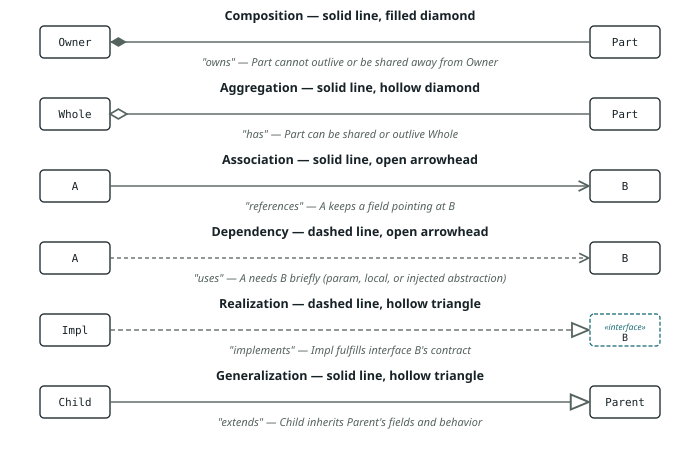

# UML Class Diagram Notation — Reference Guide

A quick-reference for the arrow/line styles used across the diagrams in
this repo (`cache/uml-diagram.svg`, `parking_lot/uml-diagram.svg`, and any
design-pattern diagrams), what plain-English verb each one maps to, when
to reach for it, and *why* that distinction is worth preserving instead of
just drawing every relationship as a plain arrow.

## The six relationships

### 1. Composition — solid line, filled diamond
- **English verb**: **owns** / is made of / cannot exist without
- **When to use**: the "part" is created by the "owner" and its lifecycle
  is entirely controlled by that owner — it is never shared with another
  owner, and it dies when the owner does.
- **Why it matters**: it's the strongest containment relationship in UML.
  Marking it composition (instead of a plain arrow) tells a reader "don't
  ask whether this could be swapped or shared elsewhere — it's private,
  exclusive state," which shortcuts a whole class of design questions.
- **Example in this repo**: `Floor *-- ParkingSpot` — a `Floor` builds its
  own `ParkingSpot`s in its constructor; no other `Floor` ever references
  them.

### 2. Aggregation — solid line, hollow diamond
- **English verb**: **has** / holds a collection of (without owning the lifecycle)
- **When to use**: the container holds a reference to something that
  could exist independently of it, be shared with other containers, or
  outlive the container.
- **Why it matters**: distinguishing this from composition changes what's
  safe to do on cleanup or refactor — an aggregated object must **not**
  be destroyed just because its container is.
- **Example**: not currently used in this repo's diagrams (everything so
  far is either full ownership or a plain reference). You'd reach for it
  if, say, a `Garage` held `Vehicle` objects that are actually owned by
  their drivers and outlive any single garage visit.

### 3. Association — solid line, open arrowhead
- **English verb**: **references** / points to / holds a reference to
- **When to use**: a stored field that points at another object, used
  across the referencing object's whole lifetime — stronger than "briefly
  uses as a parameter," but without the lifecycle ownership of composition.
- **Why it matters**: it's the "plain" relationship — a weaker claim than
  composition (no lifecycle implication) but a stronger one than
  dependency (it's a durable field, not a one-off parameter).
- **Example**: `ParkingTicket --> ParkingSpot` — the ticket keeps a
  reference to its spot for the whole parking session, but the spot's
  lifecycle is owned by `Floor`, not by the ticket.

### 4. Dependency — dashed line, open arrowhead
- **English verb**: **uses** / depends on
- **When to use**: A needs B to do its job — as a constructor-injected
  collaborator, a method parameter, or a local variable — where the
  relationship is about *behavior*, not a long-lived structural field.
- **Why it matters**: dashed = the most transient relationship. It signals
  "if B's contract changed, A would need to change too, but A isn't
  responsible for B's existence or identity." In these diagrams it's also
  used (deliberately, a bit loosely) for constructor-injected *interface*
  fields — e.g. `ParkingLot ..> PricingCalculator` — to flag "this is a
  swappable strategy" rather than "owned state," even though it's
  technically stored in a field.
- **Example**: `ParkingSpot ..> SpotSize` — `ParkingSpot` uses the enum in
  method signatures but doesn't manage its lifecycle (enums are
  singletons the JVM owns).

### 5. Realization — dashed line, hollow triangle
- **English verb**: **implements** / realizes / fulfills the contract of
- **When to use**: exactly the Java `implements` keyword — a concrete
  class provides the behavior an interface promises.
- **Why it matters**: separating this from generalization matters because
  interfaces carry no implementation or state to inherit. Realization is
  "I promise to provide these methods"; generalization is "I inherit real
  code and state." Dashed (not solid) marks that weaker, contract-only bond.
- **Example**: `FlatRatePricing ..|> PricingCalculator`,
  `ProRataPricing ..|> PricingCalculator`.

### 6. Generalization — solid line, hollow triangle
- **English verb**: **extends** / is a kind of
- **When to use**: exactly the Java `extends` keyword — a subclass
  inherits fields/methods and must be substitutable wherever the parent
  is expected (the Liskov substitution principle).
- **Why it matters**: solid (not dashed) because it's a stronger bond than
  realization — the child inherits real implementation, not just a
  contract, and the two evolve together more tightly.
- **Example**: `Bike --|> Vehicle`, `Car --|> Vehicle`, `Truck --|> Vehicle`.

## Quick decision table

| If the Java code looks like... | Draw... | Verb |
|---|---|---|
| `class X extends Y` | solid line + hollow triangle | extends |
| `class X implements Y` | dashed line + hollow triangle | implements |
| `X` creates and fully owns a `Y` (private, never shared) | solid line + filled diamond | owns |
| `X` holds a `Y` that could be shared or outlive `X` | solid line + hollow diamond | has |
| `X` keeps a `Y` reference as a field for its whole lifetime | solid line + open arrow | references |
| `X` only touches `Y` via a constructor param, method param, or local variable | dashed line + open arrow | uses |

## Bonus: box stereotypes (not arrows, but easy to confuse with them)

- `«interface»` above the name, dashed border → a Java `interface`.
- Italic class name, no stereotype → an `abstract class`.
- `«enumeration»` above the name → a Java `enum`.
- `{abstract}` after a method signature → that method has no body in this
  class; a subclass must override it.

## Why bother with six relationships instead of one arrow?

Because the whole point of a class diagram is to answer design questions
*before* you read the implementation: "if I delete this class, what
breaks?", "can I swap this out?", "who's responsible for cleaning this
up?". A diagram that draws every line the same way answers none of that —
it just repeats what the code already says. Picking the right line style
is a design decision in itself, not decoration.
